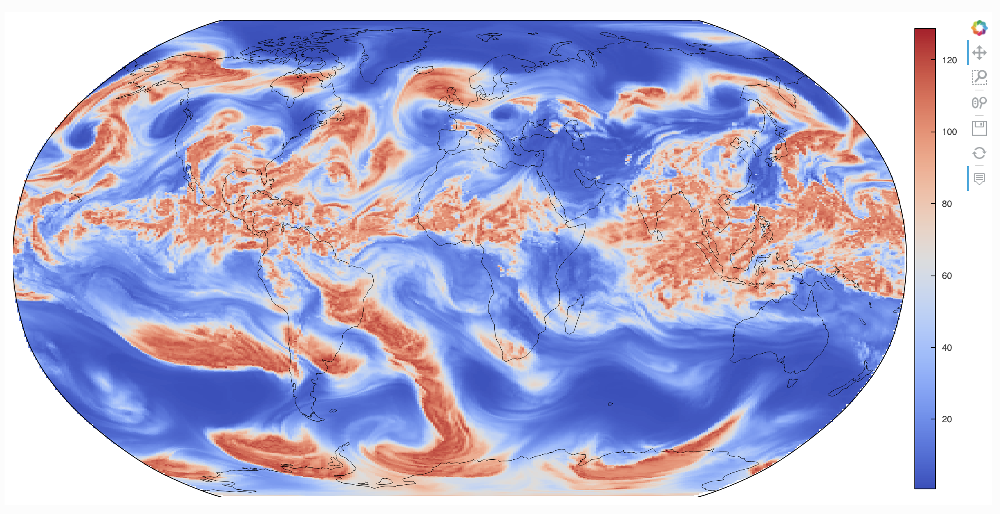



Dear GeoCAT Community,

It has been five months since the last GeoCAT update! We are planning to 
announce quarterly updates from now on. Despite the lack of announcements 
in this blog during those five long months, we have had several great news 
to share. 

Please find below our updates since October, 2021 including Interactive 
MPAS Plotting, Project Raijin developments as well as new GeoCAT 
functionalities, and community activities:  

### High-performance Interactive MPAS Plotting

GeoCAT published a high-performance, interactive [MPAS visualization 
notebook](https://geocat-examples.readthedocs.io/en/latest/gallery-notebooks/Datashader/MPAS_Datashader_Trimesh.html) 
that enables features such as pan and zoom on fine-resolution geoscience data 
(e.g. 3.75km data rendered within a few tens of seconds to a few minutes on 
personal laptops). 

Here is a snapshot of how the interactive plotting interface looks like in 
the notebook:

### Project Raijin

[Project Raijin](https://raijin.ucar.edu/) (our NSF Earth Cube award to build 
community tools for the analysis and visualization of unstructured grids 
employed by next generation Earth System models) and its collaboration with 
DOE's SEATS project (Argonne National Laboratory, UC Davis, and Lawrence 
Livermore National Laboratory)had initiated the 
[UXarray](https://uxarray.readthedocs.io/en/latest/index.html) effort. 

Just for the reference of new readers, UXarray is a new Python object based on 
the ubiquitous Xarray, which will support reading and recognizing, internal 
storage, and operation on unstructured grid models in the Python ecosystem.

If you would like to engage with Project Raijin and/or UXarray but are not 
100% sure about what the best way is to communicate, please see our 
[Contact Us](https://raijin.ucar.edu/contact.html) page!

In the recent months, there has been several updates in Project Raijin and 
UXarray such as the draft UXarray API and initial UXarray implementations.

#### Draft UXarray API

We have recently published a [draft API 
specification](https://github.com/UXARRAY/uxarray/blob/main/docs/user_api/uxarray_api.md) 
for UXarray. 

We encourage our community members to visit this draft API, share it with 
colleagues, and provide us feedback on the capabilities and user interface 
planned for UXarray. Having early input from our stakeholders is imperative 
to the success of Raijin.

#### Initial UXarray Implementation

File reading, recognition, writing for UGRID and EXODUS unstructured grid formats 
have been made available! UXarray has not been distributed on any package 
management system yet; however, the interested readers could access these 
functionalities through our 
[UXarray Github repository](https://github.com/UXARRAY/uxarray) and contribute 
with their feedback and/or implementations!

#### UXarray First Official Release Soon!

UXarray initial functions are planned to be distributed on Conda and PyPI around 
the end of April after integrated testing is finished. The first release could 
have a few analysis operators, too. Stay tuned!

### Software Releases

Before sharing our software release updates below, we'd like to announce that 
the GeoCAT toolkits (GeoCAT-comp, GeoCAT-f2py, and GeoCAT-datafiles) are planned 
to be distributed on conda-forge channel soon (Their Conda distributions are 
currently accessible via NCAR's Anaconda channel only)!

Below you can find insights about our releases on several toolkits:

#### - GeoCAT-comp March Release (v2022.03.0)!
With this release, new functionality (Spherical Harmonic deconstruction 
and reconstruction, with spherical surface voronoi weighting), improvements 
(Addressing deprecations, fixing build tests, better formatting for endnote 
links and typo correction in documentation, etc.) have been made available.

- Please see
  [GeoCAT-comp v2022.03.0 Release](https://github.com/NCAR/geocat-comp/releases/tag/v2022.03.0)
  for further information.

#### - Four GeoCAT-f2py Releases in 2022!
Please note that GeoCAT-f2py releases are accessible through GeoCAT-com! 

With several releases in 2022, code and CI improvements (Improved Dask usage 
performance, improved boilerplate codes, added type hints, cleaned Linux and 
Darwin environments, addressing of Numpy deprecations, added compatibility 
with numpy.complex dtypes, etc.) have been made available.

- Please see
  [GeoCAT-f2py Releases](https://github.com/NCAR/geocat-f2py/releases)
  for further information.

- In addition, please refer to
  [GeoCAT-comp API reference](https://geocat-comp.readthedocs.io/en/latest/api.html)
  for detailed information about the GeoCAT-comp functions and how GeoCAT-f2py 
  is contained under GeoCAT-comp.

- Please see our 
[Contributor's Guide](https://geocat.ucar.edu/pages/contributing.html) 
for detailed information about our development stack. 

### Community Events

The GeoCAT team engaged with the community through 
several activities since October, 2021, some of which were as follows:

#### Welcome on board, Heather Craker!

We are very excited to have Heather Craker accepted our full-time job 
offer for the position “Software Engineer I - Scientific Python Developer”. 
She is currently an intern in our team and will start her full-time 
employment on June 13th, 2022. Heather will graduate from Purdue 
University with Majors in Atmospheric Science and Data Science in May. 

#### SIParCS 2022 (Summer Internship Projects)

GeoCAT is ready for SIParCS 2022 with great candidates recruited for its 
three projects. We welcome and are very excited to work with:

1. Daphne Quint from CU Boulder in Project #1: Expanding GeoCAT’s 
   Visualization Capabilities.
2. Philip Chmielowiec from University of Illinois at Urbana-Champaign 
   in Project #8: Python Data Analysis & Visualization and Jupyter
   Notebook Development for Unstructured Grids Data.
3. Alina Guha from Grinnell College in Project #9: Python 
   reimplementation of Fortran subroutines for use on supercomputers.

#### - GeoCAT presentations at AGU 2021 and AMS 2022 

Kudos to Heather Craker and Michaela Sizemore et al. for their AMS talks 
as well as Anissa Zacharias, Erin Lincoln, Michaela Sizemore et al. for 
their AGU poster presentations!

As always, we welcome and appreciate any level of community contribution to 
this effort by giving feedback, reporting issues, joining us for implementation,
etc.

The GeoCAT Team - CISL/NCAR
April 1, 2022 
